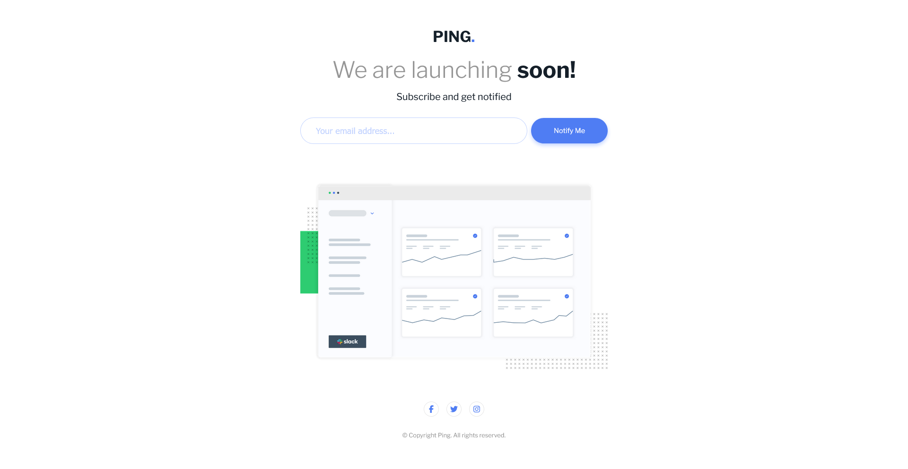

# Frontend Mentor - Ping coming soon page solution

This is a solution to the [Ping coming soon page challenge on Frontend Mentor](https://www.frontendmentor.io/challenges/ping-single-column-coming-soon-page-5cadd051fec04111f7b848da). Frontend Mentor challenges help you improve your coding skills by building realistic projects.

## Table of contents

- [Overview](#overview)
  - [The challenge](#the-challenge)
  - [Screenshot](#screenshot)
  - [Links](#links)
- [My process](#my-process)
  - [Built with](#built-with)
  - [Useful resources](#useful-resources)
- [Author](#author)

## Overview

### The challenge

Users should be able to:

- View the optimal layout for the site depending on their device's screen size
- See hover states for all interactive elements on the page
- Submit their email address using an `input` field
- Receive an error message when the `form` is submitted if:
  - The `input` field is empty. The message for this error should say _"Whoops! It looks like you forgot to add your email"_
  - The email address is not formatted correctly (i.e. a correct email address should have this structure: `name@host.tld`). The message for this error should say _"Please provide a valid email address"_

### Screenshot

### Links

- Solution URL: [Solution](https://github.com/tugcekizildg/Ping_ComingSoonPageMaster_FEMio)
- Live Site URL:[Live Preview](https://adorable-tarsier-6686eb.netlify.app)

## My process

### Built with

- Semantic HTML5 markup
- CSS custom properties

### Useful resources

- [Example resource 1](https://developer.mozilla.org/en-US/docs/Learn_web_development/Extensions/Forms/Form_validation) - This helped me for form validation.
- [Example resource 2](https://regexr.com/3e48o) - This is an amazing tool which helped me create email validation regex.

## Author

- Frontend Mentor - [@tugcekizildg](https://www.frontendmentor.io/profile/tugcekizildg)
